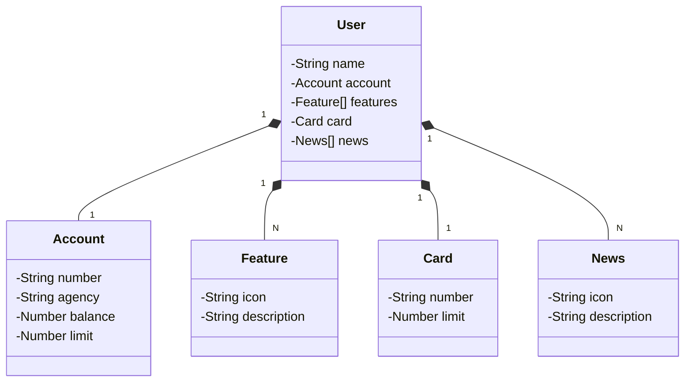

# Projeto do curso: Santander Full-Stack Developer + DIO
Projeto Santander FullStack-Dev: Java RESTful API CRUD em Java 17, Spring Boot 3 e com deploy no Railway.
## Requisitos do projeto:
Já dominamos o universo do desenvolvimento e construímos uma API REST utilizando o Java 17, a versão LTS mais recente repleta de novidades. Com o poder do Spring Boot 3, otimizamos nossa produtividade graças à sua habilidade de autoconfiguração. Além disso, facilitamos o acesso aos bancos de dados SQL com o auxílio do Spring Data JPA. Também destacamos a importância de uma documentação de API robusta e clara, utilizando o OpenAPI, ou Swagger. E com o Railway, simplificamos o Deploy de nossas soluções na nuvem. Agora, é hora de embarcar em um novo desafio e explorar um domínio de aplicação diferente, mantendo nosso foco em inovar e desenvolver soluções de alto padrão!
## Tecnologias Utilizadas
- Java 17: Utilizaremos a versão LTS mais recente do Java para tirar vantagem das últimas inovações que essa linguagem robusta e amplamente utilizada oferece;  
- Spring Boot 3: Trabalharemos com a mais nova versão do Spring Boot, que maximiza a produtividade do desenvolvedor por meio de sua poderosa premissa de autoconfiguração;  
- Spring Data JPA: Exploraremos como essa ferramenta pode simplificar nossa camada de acesso aos dados, facilitando a integração com bancos de dados SQL;  
- OpenAPI (Swagger): Vamos criar uma documentação de API eficaz e fácil de entender usando a OpenAPI (Swagger), perfeitamente alinhada com a alta produtividade que o Spring Boot oferece;  
- Railway: facilita o deploy e monitoramento de nossas soluções na nuvem, além de oferecer diversos bancos de dados como serviço e pipelines de CI/CD.
## Funcionalidades
- Cadastro, leitura, atualização e exclusão de Cliente.
## Diagrama de Classes (Domínio API)


## Cadastro
/user
```json
{
  "name": "ana",
  "account": {
    "number": "12345-6",
    "agency": "5678",
    "balance": 1350.00,
    "limit": 1000.00
  },
  "card": {
    "id": 1
    "number": "xxxx.xxxx.xxxx.0000",
    "limit": 2000.00
  },
  "features": [
    {
      "icon": "icon_url",
      "description": "icon_description"
    }
  ],
  "news": [
    {
      "icon": "news_url",
      "description": "news_description"
    }
  ]
}
```
### Status: Em Andamento


